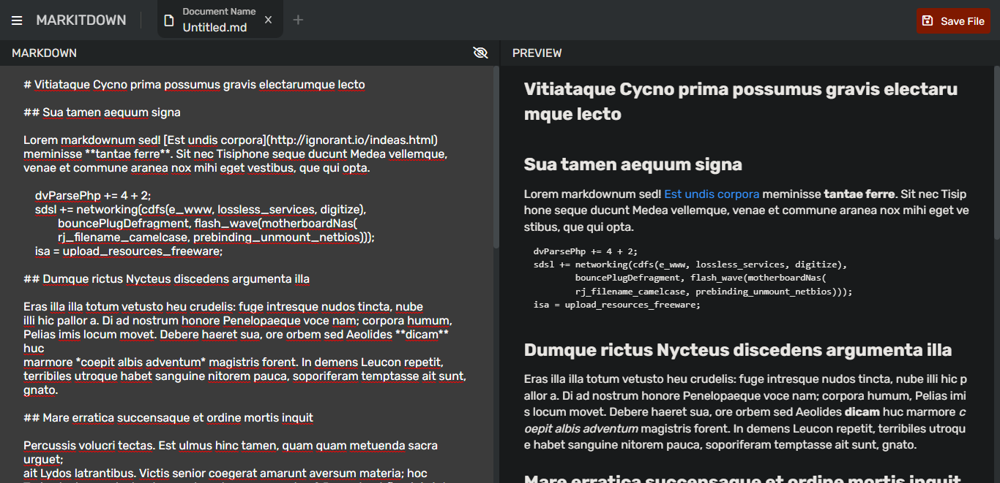
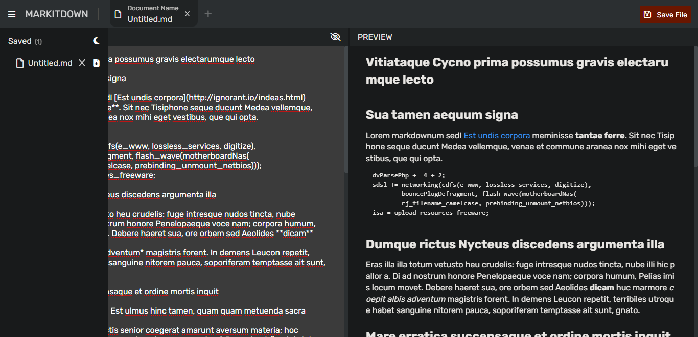
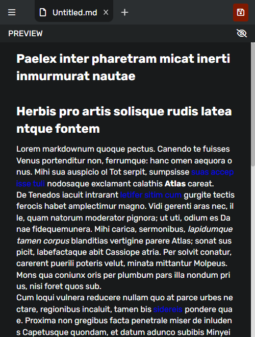

# MarkItDown

## Table of contents

- [Screenshot](#screenshot)
- [Links](#links)
- [Built with](#built-with)

## Screenshot

## Links

- [Live Site](https://i-markitdown.netlify.app/)

## Built with

- Semantic HTML5 markup
- SCSS/SASS
- Mobile-first workflow
- Javascript ES6+
- [Markdown-it package](https://www.npmjs.com/package/markdown-it)
- [File-saver package](https://www.npmjs.com/package/file-saver)
- [Fontawsome](https://fontawesome.com/)
- [Parcel](https://parceljs.org/)
